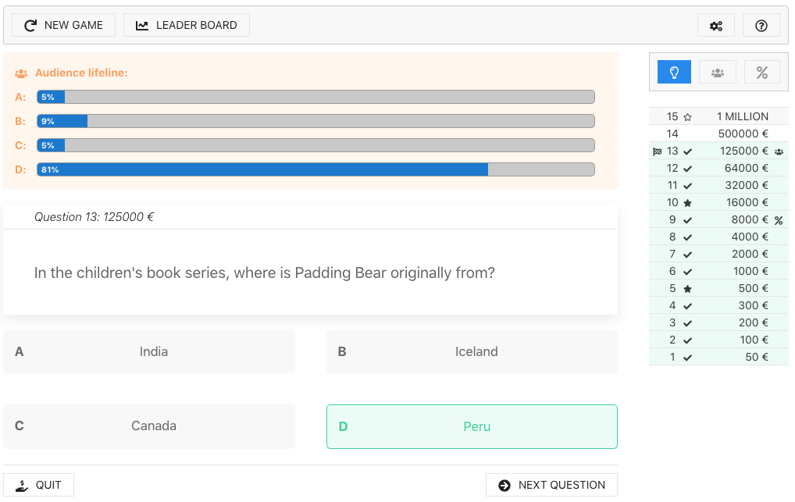

# »Millionaire Quiz« game made with vue.js for moodle
This is a quiz game plugin for Moodle. It can be added to any Moodle course as an activity. You will 
have to define levels and assign categories of your moodle question bank to each level. The game frontend 
is written with [Vue.js](https://vuejs.org/) so that playing the game doesn't require any page reloads.



# Setup
1. Install Plugin: Just download the repository as zip file and install it. You can remove the vue folder to reduce the size.
2. Go to a course and add the quiz as an activity.
3. Choose a name and, if necessary, change game options.
4. Go to the activity and configure levels through the admin screen (top right corner, gears icon).

# Game Settings and Level configuration
A new instance of this game can be added to any Moodle course through the "add activity" link in your course. You 
will be  able to set some game options (like the currency for the scores, whether or not teachers should be included
in the leader board, etc). Configuring the different levels is a screen within the app, i.e. you  will have to go 
to the activity and will see a settings icon in the top right corner of the game screen. You can add as many levels 
as you want. You need to assign at least one moodle question category to every game level. The game will 
then pick a random **single choice question** from those categories. You can decide to configure a level as "safe 
spot". A player giving a wrong answer will fall back to the nearest safe spot level and receive that score for his 
leader board rank. If you don't set a name for a level, the score of the level and the currency symbol from the game 
options will be shown instead.

# Special thanks
The initial effort of integrating Vue.js into a moodle plugin was done by Martin Gauk from TU Berlin. Cudos for your 
awesome work, Martin!

# Contribute
The javascript files and Vue components will be bundled into a single file as AMD module
`amd/build/app-lazy.min.js` using **Webpack**.
You may call functions in that module with `$PAGE->requires->js_call_amd`.

[The suffix -lazy is used to tell Moodle that the file should not be bundled with Moodle's
other AMD modules](https://docs.moodle.org/dev/Javascript_Modules#But_I_have_a_mega_JS_file_I_don.27t_want_loaded_on_every_page.3F)
That makes sense because the javascript file generated by Webpack is quite big
and is only needed for this plugin.

If you want to change the Vue components or the javascript code, you have to install
all dependencies:
```
cd vue
yarn install
```

With `npm run dev` or `npm run watch` you build the file `amd/build/app-lazy.min.js`
(in development mode) that will be loaded by the browser. Watch does not exit, it will
re-build the file whenever one of the source files was touched.

**Important: Before a commit** you should build the file with `npm run build` (production mode).
This generates a much smaller file. However, the file is not suitable for debugging using the
browser web developer tools.

Hint: you should disable Moodle's javascript cache. You may add the line `$CFG->cachejs = false;`
to `config.php`. If you disable caching, Moodle takes the file from the `amd/src` folder.
Hence, there is a symbolic link to `../build/app-lazy.min.js`.

If you want to use javascript libraries from Moodle, you have to declare them as external
dependencies in `vue/webpack.config.js` under `exports.externals`.
